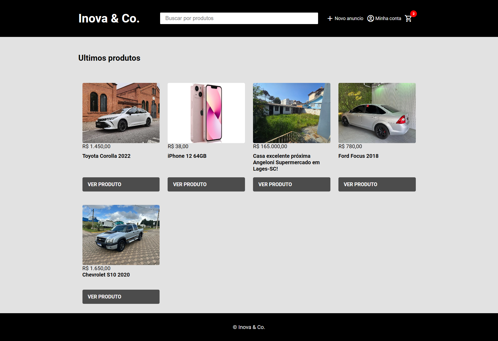
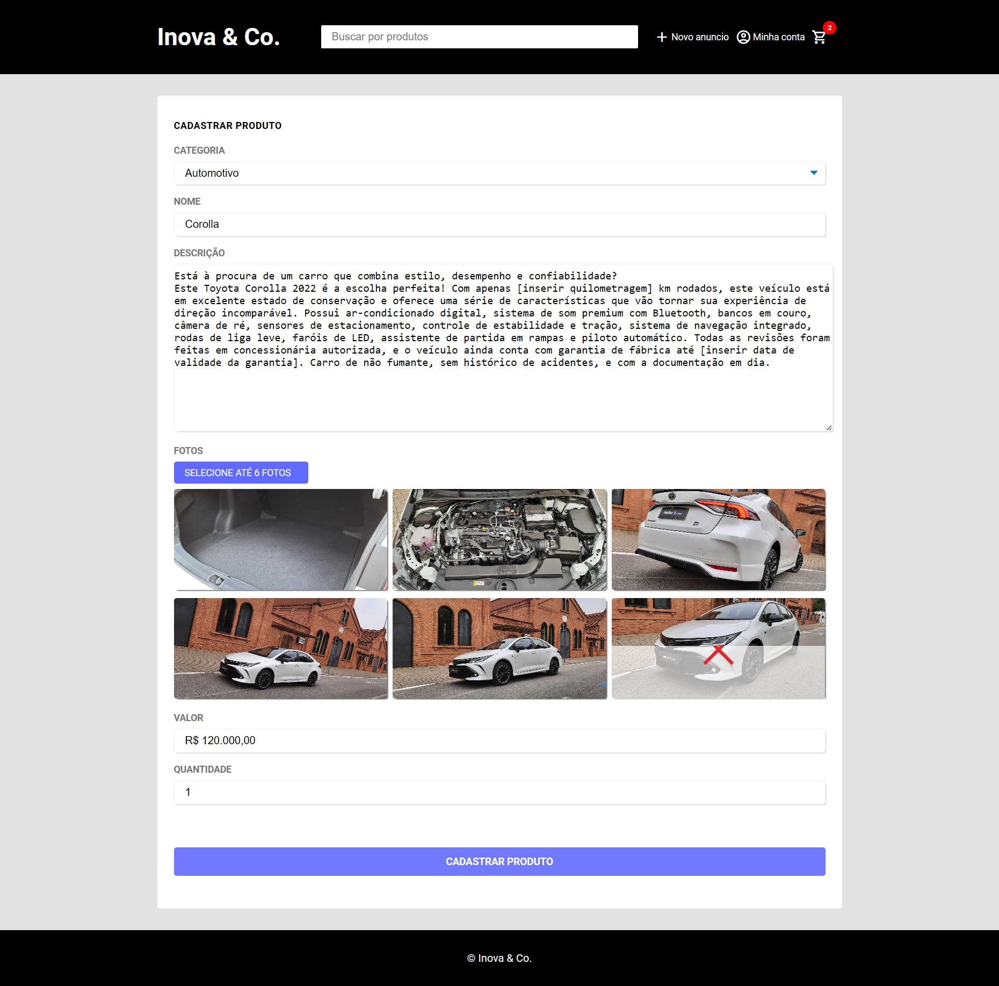
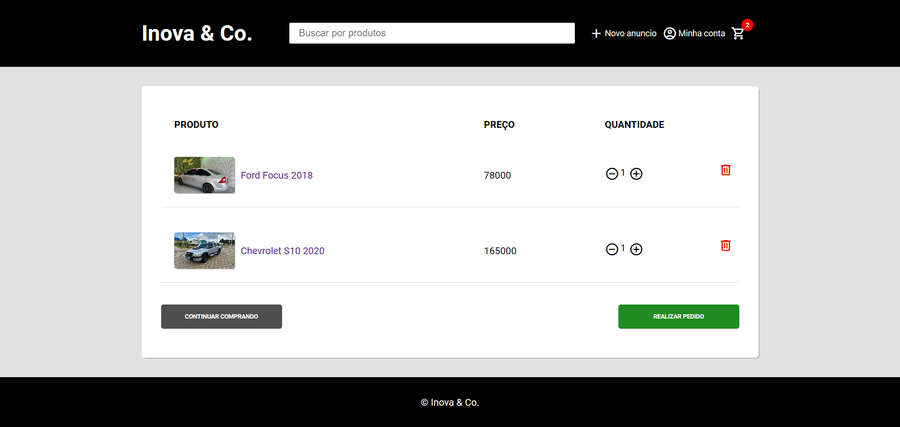
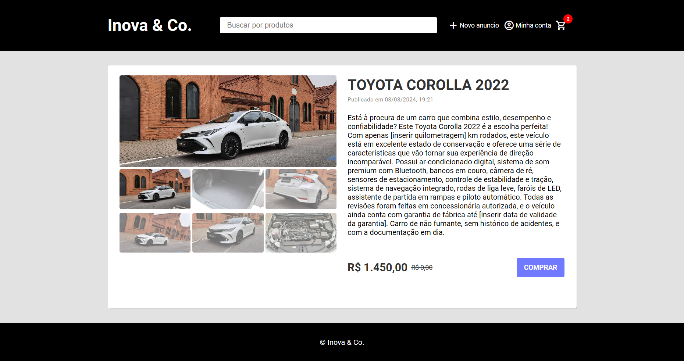
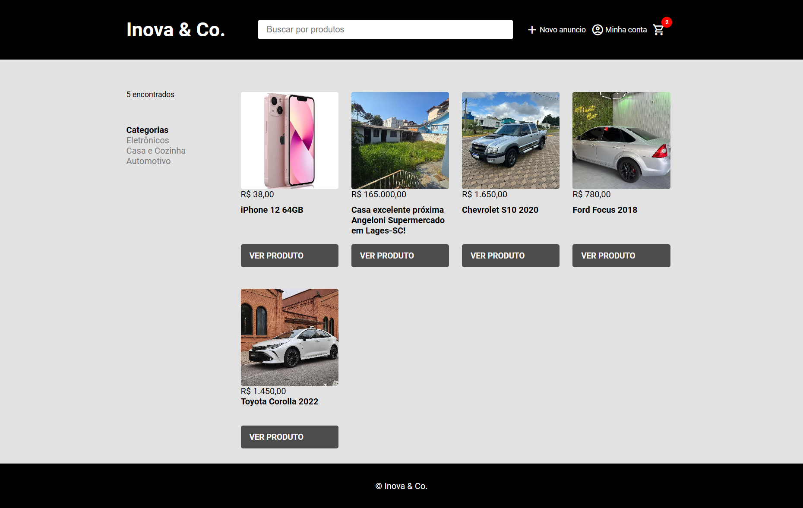
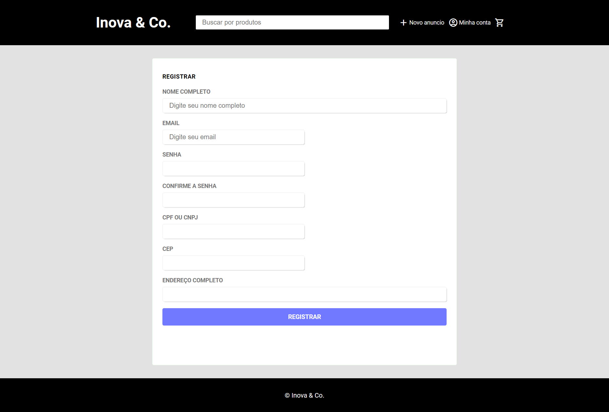
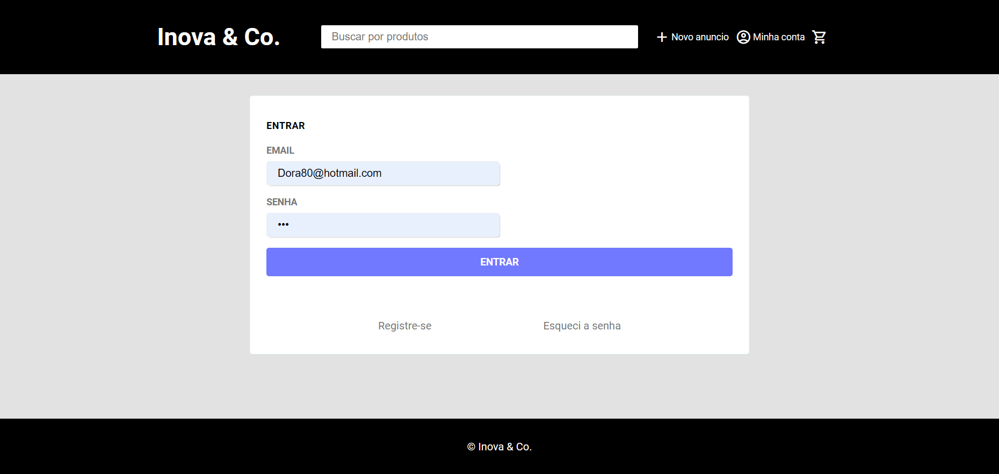

<h1 align="center">Virtual Store</h1> 
<h2 align="center">About</h2> 
<h3 align="center">This is my first project applying Domain-Driven Design (DDD) principles. The goal was to build a fully functional virtual store with registration, cart, product search, and more!</h3> 

    
    
    
    
    
    
    

    

<h2>🚀 Technologies</h2>
<ul>
    <li><strong>Docker</strong>: Containerization platform.</li>
    <li><strong>Docker Compose</strong>: Tool for defining and running multi-container Docker applications.</li>
    <li><strong>TypeScript</strong>: Strongly typed superset of JavaScript.</li>
    <li><strong>PostgreSQL</strong>: Relational database system.</li>
    <li><strong>Azurite</strong>: Microsoft Azure Storage emulator.</li>
    <li><strong>Node.js</strong>: JavaScript runtime for building the backend.</li>
</ul>

<h2>🏗️ Architecture</h2>

This project was built using <strong>Domain-Driven Design (DDD)</strong> to separate business logic into distinct domains, improving maintainability and scalability.

<h3>Features:</h3>
<ul>
    <li><strong>User Registration</strong>: Secure registration and login system.</li>
    <li><strong>Product Management</strong>: Add, edit, and remove products from the store.</li>
    <li><strong>Shopping Cart</strong>: Full cart functionality, including add, remove, and checkout options.</li>
    <li><strong>Search</strong>: Advanced product search based on various filters.</li>
</ul>
